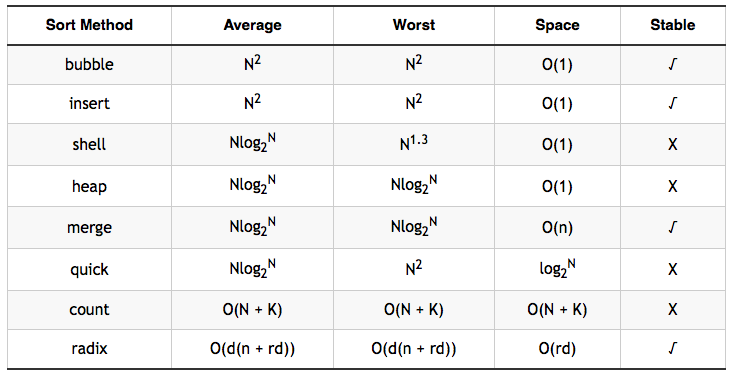
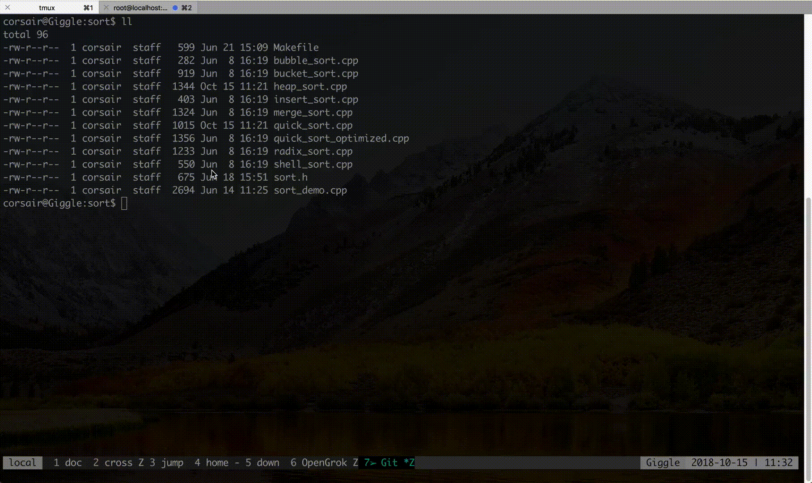
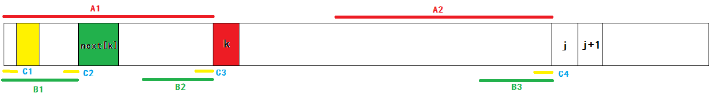

## Illustrate
- This projects aims to implement and utilize basic **data structure and algorithm**
- Thoughts come from the _Web_ and _classical books_

## Note
_Need set env variables before execute binary (`Mac` need not do this)_

```bash
export LD_LIBRARY_PATH=./lib:$LD_LIBRARY_PATH
```
_or just_

```bash
source env.sh
```

_Header directory [Inc](./inc) use soft link, making each template itself can be used as standalone_

```bash
# example
ll ./inc

common.h@ -> ../common/common.h
kmp.h@ -> ../kmp/kmp.h
md5.h@ -> ../rbtree/md5.h
rbtree.h@ -> ../rbtree/util_rbtree.h
sort.h@ -> ../sort/sort.h
```

_Each template will generate dynamic library, for shared use_

```bash
# example
ldd lib/libsort.so
        linux-vdso.so.1 =>  (0x00007ffdd0929000)
        libcommon.so => ./lib/libcommon.so (0x00002afbcd8e0000)     <= mylib
        libstdc++.so.6 => /lib64/libstdc++.so.6 (0x00002afbcdae3000)
        libm.so.6 => /lib64/libm.so.6 (0x00002afbcddeb000)
        libgcc_s.so.1 => /lib64/libgcc_s.so.1 (0x00002afbce0ed000)
        libc.so.6 => /lib64/libc.so.6 (0x00002afbce303000)
        /lib64/ld-linux-x86-64.so.2 (0x00002afbcd4b2000)
```

## Gallery

> _`kmp` & `sort` need c++11 support_<br>
_`consistent hash` uses `rbtree` which is a standalone source_

```bash
# cd Algorithm
make -j
source env.sh

# then all binary were under ./bin
```
_you can also compile each demo separately, take `sort` as example_

```bash
cd sort/
make -j

../bin/sort_demo
```

### _Concept of Sort_
#### Complexity of Time

#### _Demonstrate_


### _Concept of KMP_
#### _next array_
_you may know well about the `next` array from this figure_



#### _Demonstrate_
```bash
./bin/kmpdemo
basic kmp:
str = BBCABCDABABCDABCDABDET
pattern = BCDABDE
-1 0 0 0 0 1 0
Index = 14

optimized kmp:
str = BBCABCDABABCDABCDABDET
pattern = BCDABDE
-1 0 0 0 1 1 0
Index = 14
```

### _Red-Black Tree && Consistent Hash_
_go to [Red-Black Tree](./rbtree) && [Consistent Hash](./conhash) for detail_

## License
The [MIT](./LICENSE.txt) License (MIT)
