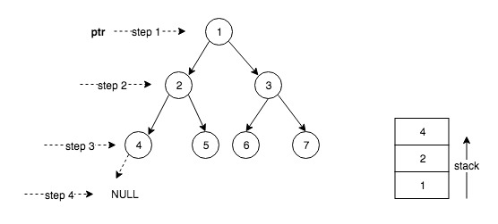
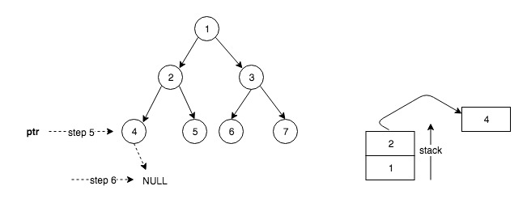
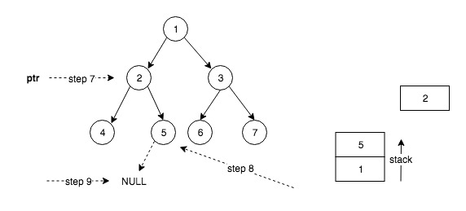

## Binary Tree Inorder Traversal
### Illustrate
<https://leetcode.com/problems/binary-tree-inorder-traversal/>

### Example
```c
Input: [1,2,3,4,5,6,7]

Output: [4,2,5,1,6,3,7]
```

### Code - _Iterative Using Stack with C++_

- operator between two criteria within the `while` is `||`
- `stk.top()` only gets the top elem of the stack, but not del it
- `stk.pop()` only dels the top elem of the stack, but not return its value

```c++
/**
 * Definition for a binary tree node.
 * struct TreeNode {
 *     int val;
 *     TreeNode *left;
 *     TreeNode *right;
 *     TreeNode() : val(0), left(nullptr), right(nullptr) {}
 *     TreeNode(int x) : val(x), left(nullptr), right(nullptr) {}
 *     TreeNode(int x, TreeNode *left, TreeNode *right) : val(x), left(left), right(right) {}
 * };
 */
class Solution {
public:
    vector<int> inorderTraversal(TreeNode* root) {
        vector<int> ret;
        if (!root) {
            return ret;
        }

        stack<TreeNode*> stk;
        TreeNode* pNode = root;

        while (pNode || !stk.empty()) {
            if (pNode) {
                // Traverse left subtree
                stk.push(pNode);
                pNode = pNode->left;
            } else {
                // Process the current node
                pNode = stk.top();
                stk.pop();
                ret.push_back(pNode->val);

                // Traverse right subtree
                pNode = pNode->right;
            }
        }

        return ret;
    }
};
```

### Code - _Iterative Using Stack with Java_
[Java Stack Tutorial](https://docs.oracle.com/javase/7/docs/api/java/util/Stack.html)

- remove

E remove()
Retrieves and removes the head of this queue. This method differs from poll only in that it throws an exception if this queue is empty.

Returns:
the head of this queue

Throws:
NoSuchElementException - if this queue is empty

```java
class Solution {
    public List<Integer> inorderTraversal(TreeNode root) {
        List<Integer> ret = new ArrayList<>();
        if (root == null) {
            return ret;
        }
        Stack<TreeNode> stk = new Stack<>();
        TreeNode node = root;

        while ((node != null) || !stk.isEmpty()) {
            if (node != null) {
                stk.push(node);
                node = node.left;
            } else {
                node = stk.pop();

                ret.add(node.val);
                node = node.right;
            }
        }
        return ret;
    }
}
```

### Demo for Stack Solution One
#### Step1


#### Step2



#### Step3


### Code - _Recursive the Simplest_
_according to definition of `InOrder Traversal`_

UK [trəˈvərs(ə)l]  USA [trəˈvərs(ə)l]

```c++
/**
 * Definition for a binary tree node.
 * struct TreeNode {
 *     int val;
 *     TreeNode *left;
 *     TreeNode *right;
 *     TreeNode(int x) : val(x), left(NULL), right(NULL) {}
 * };
 */
class Solution {
public:
    vector<int> inorderTraversal(TreeNode* root) {
        vector<int> ret;
        inOrder(root, ret);
        return ret;
    }

    void inOrder(TreeNode *root, vector<int> &ret) {
        if (root == NULL) {
            return;
        }
        inOrder(root->left, ret);
        ret.push_back(root->val);
        inOrder(root->right, ret);
    }
};
```
