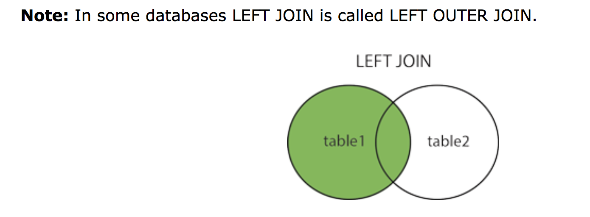

## Introduction to SQL Syntax
### Online Learning Website
- <http://sqlfiddle.com/>
- <https://sqlbolt.com/>
- <http://www.w3school.com.cn/sql/>
- <https://www.codecademy.com/learn/learn-sql>
- <https://www.codecademy.com/learn/sql-table-transformation>
- <http://www.w3resource.com/sql-exercises/>
- <https://www.tutorialspoint.com/hive/>
- <http://www.sql-ex.ru/>

### SQL Execution Order
```sql
SELECT DISTINCT <select_list>
FROM <left_table>
<join_type> JOIN <right_table>
ON <join_condition>
WHERE <where_condition>
GROUP BY <group_by_list>
HAVING <having_condition>
ORDER BY <order_by_condition>
LIMIT <limit_number>
```

### SQL Keyword

#### [INNER JOIN](https://www.w3schools.com/sql/sql_join_inner.asp)
The INNER JOIN keyword selects records that have matching values in both tables.

<div align=left></div>

#### [LEFT JOIN](https://www.w3schools.com/sql/sql_join_left.asp)
The LEFT JOIN keyword returns all records from the left table (table1), and the matched records from the right table (table2). The result is NULL from the right side, if there is no match.

<div align=left></div>