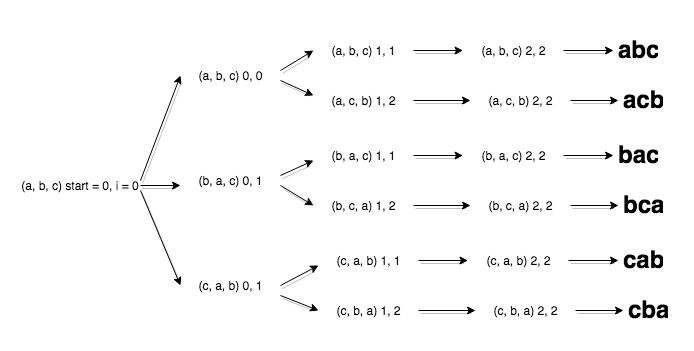

## 字符串的排列
### Illustrate
<https://www.nowcoder.com/practice/fe6b651b66ae47d7acce78ffdd9a96c7?tpId=13&tqId=11180&tPage=2&rp=1&ru=%2Fta%2Fcoding-interviews&qru=%2Fta%2Fcoding-interviews%2Fquestion-ranking>

输入一个字符串,按**字典序**打印出该字符串中字符的**所有排列**。

输入描述:
输入一个字符串,长度不超过9(可能有字符重复), 字符只包括大小写字母。

### Example
```c
Input: abc
Output: abc,acb,bac,bca,cab,cba

```

### Code - _Set_

> if not know removig duplicates, try Input `aaa`

_use set to remove duplicates and sort remaining_
<div align=center></div>

```c
class Solution {
public:
    vector<string> Permutation(string str) {
        // use set to remove duplicate and sort
        set<string> bottle;
        if (str.size() == 0) {
            return vector<string>();
        }
        dfs(str, 0, bottle);
        return vector<string>(bottle.begin(), bottle.end());
    }

    void dfs(string str, int index, set<string> &bottle) {
        if (index == str.size()) {
            bottle.insert(str);
            return;
        }
        // handle main
        for (int i = index; i < str.size(); ++i) {
            swap(str[index], str[i]);
            dfs(str, index + 1, bottle);
            // swap back for next new swap
            swap(str[index], str[i]);
        }
    }
};
```
