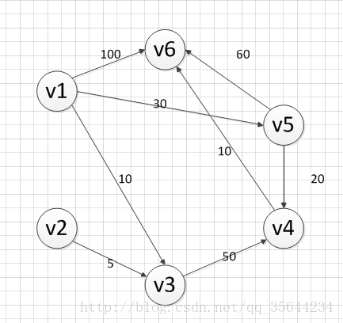

## Dijkstra
### _Breadth-First-Search_

Dijkstra’s algorithm solves the **single-source** shortest-paths problem on a **weighted**,**directed** graph `G = (V, E)` for the case in which all edge weights are **nonnegative**.

### Algorithm
1. Mark all nodes unvisited. Create a set of all the unvisited nodes called the unvisited set.
2. Assign to every node a tentative distance value: set it to zero for our initial node and to infinity for all other nodes. Set the initial node as current.
3. For the current node, consider all of its unvisited neighbors and calculate their tentative distances through the current node. Compare the newly calculated tentative distance to the current assigned value and assign the smaller one. For example, if the current node A is marked with a distance of 6, and the edge connecting it with a neighbor B has length 2, then the distance to B through A will be 6 + 2 = 8. If B was previously marked with a distance greater than 8 then change it to 8. Otherwise, keep the current value.

4. When we are done considering all of the unvisited neighbors of the current node, mark the current node as visited and remove it from the unvisited set. A visited node will never be checked again.
5. If the destination node has been marked visited (when planning a route between two specific nodes) or if the smallest tentative distance among the nodes in the unvisited set is infinity (when planning a complete traversal; occurs when there is no connection between the initial node and remaining unvisited nodes), then stop. The algorithm has finished.
6. Otherwise, select the unvisited node that is marked with the smallest tentative distance, set it as the new "current node", and go back to step 3.