## List & HList from Linux Kernel
### Contents of List
- [Memory Model of `List`](#memorymodel)
- [List Data Structure](#listdata)
- [Entry Struct for Demo Usage of `list`](#listfordemo)
- [INIT\_LIST\_HEAD](#initlisthead)
- [__list\_add](#plistadd)
- [list\_add](#listadd)
- [list\_add\_tail](#listaddtail)
- [__list\_del](#plistdel)
- [list\_del](#listdel)
- [LIST\_POISON](#poison)
- [offsetof](#offsetof)
- [container\_of](#containerof)
- [list\_entry](#listentry)
- [list\_for\_each\_entry](#listforeachentry)
- [list\_for\_each\_entry\_safe](#listforeachentrysafe)

### Contents of HList - Hash List
- [Memory Model of `HList`](#memorymodelhlist)
- [HList Data Structure](#hlistdata)
- [Entry Struct for Demo Usage of `hlist`](#hlistfordemo)
- [INIT\_HLIST\_HEAD](#inithlisthead)
- [hlist\_add\_head](#hlistaddhead)
- [__hlist\_del](#phlistdel)
- [hlist\_del](#hlistdel)
- [hlist\_for\_each\_entry](#hlistforeachentry)
- [hlist\_for\_each\_entry\_safe](#hlistforeachentrysafe)

<a id=listdata></a>
### Data Structure
_classical definition of simple **circular linked-list**_

```c
typedef struct list_head list_head_t;
struct list_head {
    struct list_head *next;
    struct list_head *prev;
};
```

<a id=listfordemo></a>
### Entry Struct for Demo Usage of `list`
take `struct my_obj` for example, illustrate to how to use `list`

```c
struct my_obj {
    char *name;
    void *param;
    int (*parse)(struct my_obj *obj, struct my_conf *conf);
    int (*check)(struct my_obj *obj, my_cmt_t cmd);
    // list member here
    struct list_head list;
};
```

<a id=initlisthead></a>
### INIT\_LIST\_HEAD
_the parameter `head` was pointer_

```c
#define INIT_LIST_HEAD(head) do { \
    (head)->next = (head); \
    (head)->prev = (head); \
} while(0)
```

one example:

```c
struct list_head head;
// use semicolon at the end just like call a function
INIT_LIST_HEAD(&head);
```

<div align=center>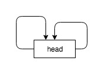</div>

or you could define it as a function

```c
static inline void INIT_LIST_HEAD(struct list_head *list)
{
    list->next = list;
    list->prev = list;
}
```

<a id=plistadd></a>
### __list\_add
```c
/*
 * __list_add insert new entry between two known consecutive entries
 * @__new: the entry about to insert
 * @__prev: previous entry after @__new inserted
 * @__next:  next entry after @__new inserted
 * @return void
 *
 * This is only for internal list manipulation where we know
 * the prev/next entries already!
 */
static inline void __list_add(list_head_t *__new, list_head_t *__prev,
                              list_head_t *__next) {
    __prev->next = __new;
    __new->prev  = __prev;
    __next->prev = __new;
    __new->next  = __next;
}
```

<a id=listadd></a>
### list\_add
> _head insert, good for implementing `stack`_

```c
static inline void list_add(list_head_t *__new, list_head_t *head) {
    __list_add(__new, head, head->next);
}

// list_add(&my_obj->list, &list_head);
```

<div align=center>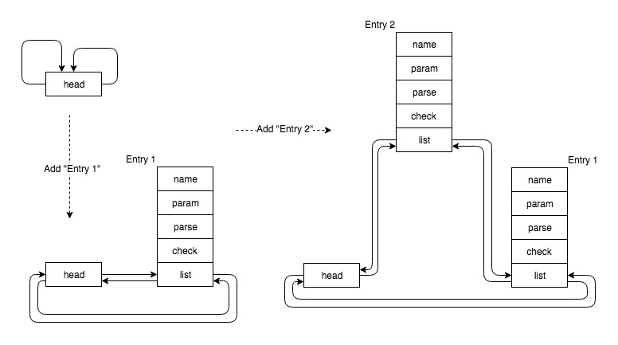</div>

<a id=listaddtail></a>
### list\_add\_tail
> _tail insert, good for implementing `queue`_

```c
static inline void list_add_tail(list_head_t *__new, list_head_t *head) {
    __list_add(__new, head->prev, head);
}

// list_add(&my_obj->list, &list_head);
```

<div align=center>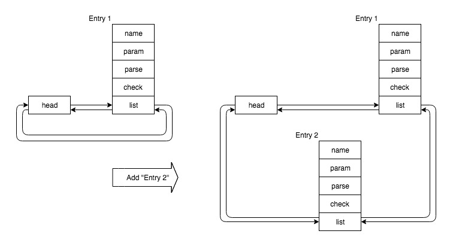</div>

<a id=plistdel></a>
### __list\_del
```c
/*
 * Delete a list entry by making the prev/next entries
 * point to each other.
 *
 * This is only for internal list manipulation where we know
 * the prev/next entries already!
 */
static inline void __list_del(list_head_t *__prev, list_head_t *__next) {
    __next->prev = __prev;
    __prev->next = __next;
}
```

<a id=listdel></a>
### list\_del
```c
static inline void list_del(list_head_t *__del) {
    __list_del(__del->prev, __del->next);
    __del->next = LIST_POISON1;
    __del->prev = LIST_POISON2;
}

// list_del(&my_obj->list, &list_head);
// free(my_obj);
```

<div align=center>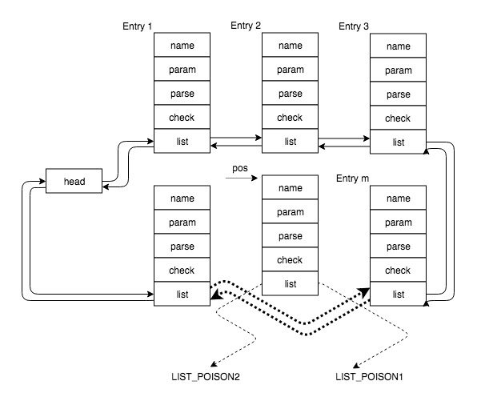</div>

**Then `pos` should be freed by the caller himself**

<a id=poison></a>
### LIST\_POISON
```c
/*
 * These are non-NULL pointers that will result in page faults
 * under normal circumstances, used to verify that nobody uses
 * non-initialized list entries.
 */
// two meaningless position
#define LIST_POISON1  ((void *) 0x00100100
#define LIST_POISON2  ((void *) 0x00200200
```

<a id=memorymodel></a>
### Memory Model
each entry chanied like this

<div align=center>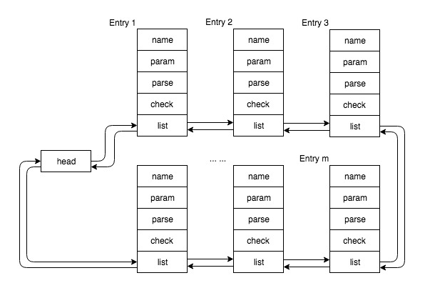</div>

<a id=offsetof></a>
### offsetof
> priority of _Get Member_ `->` is **higher than** _Get Address_ `&` and _Type Cast_ `()`

1. cast **0** to type *
2. get the value of `member` of **type** (can not be executed alone, may cause _**segmemtation fault**_)
3. get the address of this `member`
4. cast this `got address` to size_t

for start address of this **type** is **0**, so such `got address` of this `member` is it's offset plus **0**, whose type is pointer type of the `member` itself, which need cast to type `size_t`.

```c
/*
 * calculate offset of a member in the structure
 */
#ifndef offsetof
#define offsetof(type, member) ((size_t) &((type *)0)->member)
#endif
```

little illustrate as:

```c
struct myoff {
    int a;
    int b;
    int c;
};

((struct myoff *)0)->c            => Segmentation Fault (SIGSEGV)
(((struct myoff *)0)->c)          = 8 (type: int *)
(size_t) (((struct myoff *)0)->c) = 8 (type: size_t)
```

<a id=containerof></a>
### container_of
```c
/*
 * container_of - cast a member of a structure out to the containing structure
 * @ptr:  the pointer to the member.
 * @type: the type of the container struct this is embedded in.
 * @member:	the name of the member within the struct.
 *
 */
#define container_of(ptr, type, member) ({ \
            const typeof( ((type *)0)->member ) *__mptr = (ptr); \
            (type *)( (char *)__mptr - offsetof(type,member) );})
```

_or short_

```c
#define container_of(ptr, type, member) \
    (type *)((char *)(ptr) - offsetof(type, member))
```

_or directly this_

```c
#define container_of(ptr, type, member) \
    (type *)((char *)(ptr) - ((size_t) &((type *)0)->member))
```

<a id=listentry></a>
### list\_entry
```c
/*
 * list_entry - cast a member of a structure out to the containing structure
 *            - just as container_of
 * @ptr:	the pointer to the member.
 * @type:	the type of the container struct @member was embedded in.
 * @member:	the name of the member within the struct.
 */
#define list_entry(ptr, type, member) container_of(ptr, type, member)
```

<div align=center>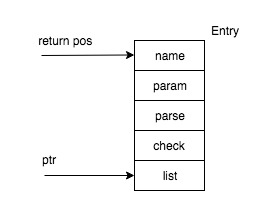</div>

<a id=listforeachentry></a>
### list\_for\_each\_entry
```c
/*
 * list_for_each_entry iterate over list of given type
 * @pos:  the type * to use as a loop counter(temporary storage)
 * @head: head of the list
 * @member: the name of the member within the list structure
 */
#define list_for_each_entry(pos, head, member) \
    for (pos = list_entry((head)->next, typeof(*pos), member); \
         &pos->member != (head); \
         pos = list_entry(pos->member.next, typeof(*pos), member))
```

<div align=center>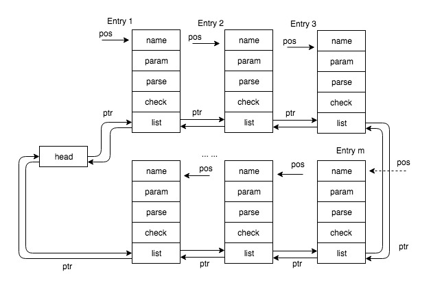</div>

<a id=listforeachentrysafe></a>
### list\_for\_each\_entry\_safe
can be used for iterating to **free** the whole list, and `n` was the same type as `pos`

```c
/*
 * list_for_each_entry_safe - iterate over list of given type safe against removal of list entry
 * @pos:    the type * to use as a loop cursor.
 * @n:      another type * to use as temporary storage
 * @head:   the head for your list.
 * @member: the name of the list_struct within the struct.
 */
#define list_for_each_entry_safe(pos, n, head, member)          \
    for (pos = list_entry((head)->next, typeof(*pos), member),  \
         n = list_entry(pos->member.next, typeof(*pos), member); \
         &pos->member != (head);                     \
         pos = n, n = list_entry(n->member.next, typeof(*n), member))
```

---

<a id=hlistdata></a>
### HList Data Structure
- **next** points to the next node
- **pprev** points to the `next` of previous node, so `*pprev` points to current node.
- for the **first one** node, it's `pprev` points to `first`,  so `*pprev` also points to current node.

```c
/* for kernel hash list */
struct hlist_head {
    struct hlist_node *first;
};

struct hlist_node {
    struct hlist_node *next;
    struct hlist_node **pprev;
};
```

<a id=hlistfordemo></a>
### Entry Struct for Demo Usage of `hlist`
take `struct my_obj` for example, illustrate to how to use `hlist`

```c
struct my_obj {
    char *name;
    void *param;
    int (*parse)(struct my_obj *obj, struct my_conf *conf);
    int (*check)(struct my_obj *obj, my_cmt_t cmd);
    // list member here
    struct hlist_node hlist;
};
```

<a id= memorymodelhlist></a>
### Memory Model of `HList`
using head insert method

<div align=center>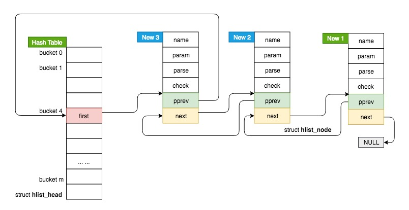</div>

<a id=inithlisthead></a>
### INIT\_HLIST\_HEAD
```c
#define INIT_HLIST_HEAD(ptr) ((ptr)->first = NULL)
```
<div align=center>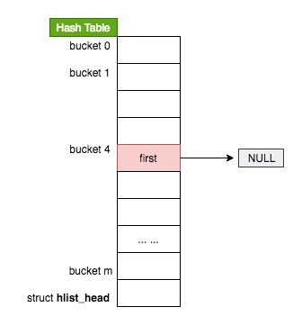</div>

<a id=hlistaddhead></a>
### hlist\_add\_head

Head Insert - as stack

```c
static inline void
hlist_add_head(struct hlist_node *__new, struct hlist_head *head) {
    struct hlist_node *first = head->first;
    // head->first was initialized NULL
    __new->next = first;

    if (first) {
        first->pprev = &__new->next;
    }
    head->first  = __new;
    __new->pprev = &head->first;
}
```

**add first one entry** - add `New 1`

<div align=center>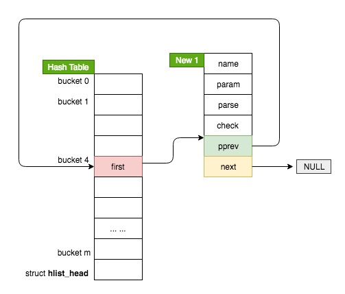</div>

**add another one entry** - add `New 2`

<div align=center>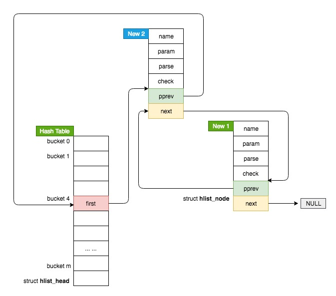</div>

<a id=phlistdel></a>
### __hlist\_del
```c
static inline void __hlist_del(struct hlist_node *__del) {
    struct hlist_node *__next   = __del->next;
    struct hlist_node **__pprev = __del->pprev;
    *__pprev = __next;
    if (__next) {
        __next->pprev = __pprev;
    }
}
```

<a id=hlistdel></a>
### hlist\_del
```c
static inline void hlist_del(struct hlist_node *__del) {
    __hlist_del(__del);
    __del->next  = LIST_POISON1;
    __del->pprev = LIST_POISON2;
}
```

<div align=center>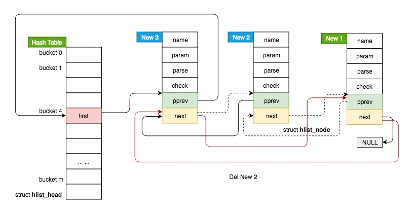</div>

<a id=hlistforeachentry></a>
### hlist\_for\_each\_entry
```c
/*
 * hlist_for_each_entry - iterate over list of given type
 * @pos:    the type * to use as a loop cursor.
 * @head:   the head for your list.
 * @member: the name of the hlist_node within the struct.
 */
#define hlist_for_each_entry(pos, head, member)             \
    for (pos = hlist_entry_safe((head)->first, typeof(*(pos)), member);\
         pos;                           \
         pos = hlist_entry_safe((pos)->member.next, typeof(*(pos)), member))
```

<a id=hlistforeachentrysafe></a>
### hlist\_for\_each\_entry\_safe
**Notice:** `n` was type as `pos->member.next`, not as that of `pos`, which is different with `list_for_each_entry_safe`

```c
/*
 * hlist_for_each_entry_safe - iterate over list of given type safe against removal of list entry
 * @pos:    the type * to use as a loop cursor.
 * @n:      another &struct hlist_node to use as temporary storage
 * @head:   the head for your list.
 * @member: the name of the hlist_node within the struct.
 */
#define hlist_for_each_entry_safe(pos, n, head, member)         \
    for (pos = hlist_entry_safe((head)->first, typeof(*pos), member);\
         pos && ({ n = pos->member.next; 1; });         \
         pos = hlist_entry_safe(n, typeof(*pos), member))
```