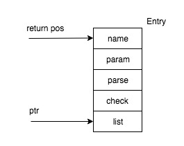
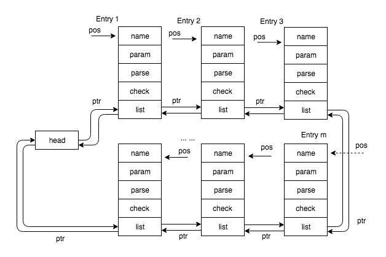

## List from Linux Kernel
### Contents
- [List Data Structure](#datastructure)
- [INIT\_LIST\_HEAD](#initlisthead)
- [Container Struct for Demo](#fordemo)
- [__list\_add](#plistadd)
- [list\_add](#listadd)
- [list\_add\_tail](#listaddtail)
- [Memory Model](#memorymodel)
- [offsetof](#offsetof)
- [container\_of](#containerof)
- [list\_entry](#listentry)
- [list\_for\_each\_entry](#listforeachentry)
- [A Simple Usage Example](#usageexample)

<a id=datastructure></a>
### Data Structure
_classical definition of simple **circular linked-list**_

```c
typedef struct list_head list_head_t;
struct list_head {
    struct list_head *next, *prev;
};
```

<a id=initlisthead></a>
### INIT\_LIST\_HEAD

_param `head` was pointer_

```c
#define INIT_LIST_HEAD(head) do { \
    (head)->next = (head); \
    (head)->prev = (head); \
} while(0)
```

or

```c
static inline void INIT_LIST_HEAD(list_head_t *list) {
    list->next = list;
    list->prev = list;
}
```

one example:

```c
struct list_head head;
// use semicolon at the end just like call a function
INIT_LIST_HEAD(&head);
```

<div align=center></div>

or you could define it as a function

```c
static inline void INIT_LIST_HEAD(struct list_head *list)
{
    list->next = list;
    list->prev = list;
}
```

<a id=fordemo></a>
### Container Struct for Demo
take `struct my_obj` for example, illustrate to how to use `list`

```c
struct my_obj {
    char *name;
    void *param;
    int (*parse)(struct my_obj *obj, struct my_conf *conf);
    int (*check)(struct my_obj *obj, my_cmt_t cmd);
    // list member here
    struct list_head list;
};
```

<a id=plistadd></a>
### __list\_add
```c
/*
 * __list_add insert new entry between two known consecutive entries
 * @newEntry: the entry about to insert
 * @prevEntry: previous entry after @newEntry inserted
 * @nxtEntry:  next entry after @newEntry inserted
 * @return void
 *
 * This is only for internal list manipulation where we know
 * the prev/next entries alread!
 */
static inline void __list_add(list_head_t *newEntry, list_head_t *prevEntry,
                              list_head_t *nxtEntry) {
    nxtEntry->prev  = newEntry;
    prevEntry->next = newEntry;
    newEntry->prev = prevEntry;
    newEntry->next = nxtEntry;
}
```

<a id=listadd></a>
### list\_add

> _head insert, good for implementing `stack`_

```c
static inline void list_add(list_head_t *newEntry, list_head_t *head) {
    __list_add(newEntry, head, head->next);
}
```

<div align=center></div>

<a id=listaddtail></a>
### list\_add\_tail

> _tail insert, good for implementing `queue`_

```c
static inline void list_add_tail(list_head_t *newEntry, list_head_t *head) {
    __list_add(newEntry, head->prev, head);
}
```

<div align=center></div>

<a id=memorymodel></a>
### Memory Model
each entry chanied like this

<div align=center></div>

<a id=offsetof></a>
### offsetof
```c
/*
 * calculate offset of a member in the structure
 * priority of '->' is higher than get address '&' and type cast '()'
 * & before ((type *)0) is a must, or end with segmemtation fault
 */
#ifndef offsetof
#define offsetof(type, member) ((size_t) &((type *)0)->member)
#endif
```

<a id=containerof></a>
### container_of
```c
/*
 * container_of - cast a member of a structure out to the containing structure
 * @ptr:  the pointer to the member.
 * @type: the type of the container struct this is embedded in.
 * @member:	the name of the member within the struct.
 *
 */
#define container_of(ptr, type, member) ({ \
            const typeof( ((type *)0)->member ) *__mptr = (ptr); \
            (type *)( (char *)__mptr - offsetof(type,member) );})
```

_or short_

```c
#define container_of(ptr, type, member) \
    (type *)((char *)(ptr) - (char *) &((type *)0)->member)
```

<a id=listentry></a>
### list\_entry
```c
/*
 * list_entry - cast a member of a structure out to the containing structure
 *            - just as container_of
 * @ptr:	the pointer to the member.
 * @type:	the type of the container struct @member was embedded in.
 * @member:	the name of the member within the struct.
 */
#define list_entry(ptr, type, member) container_of(ptr, type, member)
```

<div align=center></div>

<a id=listforeachentry></a>
### list\_for\_each\_entry
```c
/*
 * list_for_each_entry iterate over list of given type
 * @pos:  the type * to use as a loop counter(temporary storage)
 * @head: head of the list
 * @member: the name of the member within the list structure
 */
#define list_for_each_entry(pos, head, member) \
    for (pos = list_entry((head)->next, typeof(*pos), member); \
                &pos->member != (head); \
                pos = list_entry(pos->member.next, typeof(*pos), member))
```

<div align=center></div>

### LIST\_POISON
```c
/*
 * These are non-NULL pointers that will result in page faults
 * under normal circumstances, used to verify that nobody uses
 * non-initialized list entries.
 */
#define LIST_POISON1  ((void *) 0x00100100
#define LIST_POISON2  ((void *) 0x00200200
```

<a id=usageexample></a>
### A Simple Usage Example
```c
const int N = 3;
// define & init list head
struct list_head head;
INIT_LIST_HEAD(&head);

// add each node into list head
struct my_obj myObj[N];
for (int i = 0; i < N; ++i) {
    list_add(&myObj[i].list, &head);
}

// traverse through list
struct my_obj *pos;
list_for_each_entry(pos, &head, list) {
    if (strcmp(cur->name, "corsair") == 0) {
        return pos;
    }
}
```