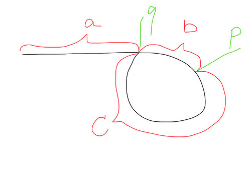

## Linked List Cycle II
### Illustrate
<https://leetcode.com/problems/linked-list-cycle-ii/description/>

Given the head of a linked list, return the node where the cycle begins. If there is no cycle, return null.

There is a cycle in a linked list if there is some node in the list that can be reached again by continuously following the next pointer. Internally, pos is used to denote the index of the node that tail's next pointer is connected to (0-indexed). It is -1 if there is no cycle. Note that pos is not passed as a parameter.

Do not modify the linked list.

### Analysis
When fast and slow meet at point p, the length they have run are 'a+2b+c' and 'a+b'.

Since the fast is 2 times faster than the slow. So a+2b+c == 2(a+b), then we get 'a==c'.

So when another slow2 pointer run from head to 'q', at the same time, previous slow pointer will run from 'p' to 'q', so they meet at the pointer 'q' together.

<div align=left></div>

### Code
```c++
/**
 * Definition for singly-linked list.
 * struct ListNode {
 *     int val;
 *     ListNode *next;
 *     ListNode(int x) : val(x), next(NULL) {}
 * };
 */
class Solution {
public:
    ListNode *detectCycle(ListNode *head) {
        if (head == NULL) return NULL;
        ListNode *fastPtr = head;
        ListNode *slowPtr = head;

        while (fastPtr != NULL && fastPtr->next != NULL) {
            fastPtr = fastPtr->next->next;
            slowPtr = slowPtr->next;

            // confirm that there's a cycle
            if (fastPtr == slowPtr) {
                ListNode *slow2Ptr = head;
                // find where the cycle begins
                while (slowPtr != NULL) {
                    // Bug point: Input [1, 2], and the cycle begins at node 0
                    // Should judge first, and then travel forward
                    if (slowPtr == slow2Ptr) {
                        return slowPtr;
                    }
                    slowPtr = slowPtr->next;
                    slow2Ptr = slow2Ptr->next;
                }
            }
        }
        return NULL;
    }
};
```
