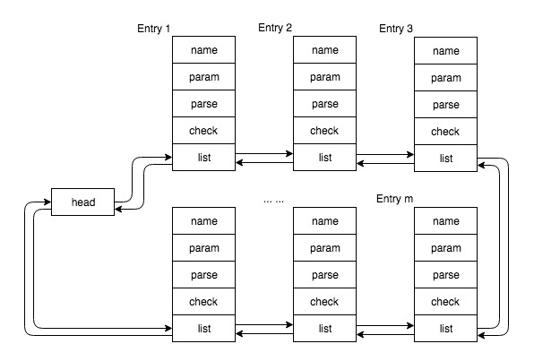

## List

### Contents
- [File Path of Linux](#filepath)
- [Data Structure](#datastructure)
- [INIT\_LIST\_HEAD](#initlisthead)
- [list\_add](#listadd)
- [list\_add\_tail](#listaddtail)
- [Memory Model](#memorymodel)
- [offsetof](#offsetof)
- [container\_of](#containerof)

<a id=filepath></a>
### Path
```bash
/linux-3.11/include/linux/list.h
/linux-3.11/include/linux/types.h
```

<a id=datastructure></a>
### Data Structure
```c
struct list_head {
	struct list_head *next, *prev;
};
```

<a id=initlisthead></a>
### INIT\_LIST\_HEAD
```c
#define INIT_LIST_HEAD(head) do { \
    (head)->next = (head); \
    (head)->prev = (head); \
} while(0)
```

_could be called by_

```c
struct list_head list;
// use semicolon at the end just like call a function
INIT_LIST_HEAD(head);
```

<div align=center></div>

> or you could define it as a function

```c
static inline void INIT_LIST_HEAD(struct list_head *list)
{
	list->next = list;
	list->prev = list;
}
```

<a id=listadd></a>
### list\_add

> _head insert, googd for implementing `stack`_

```c
static inline void list_add(list_head_t *newEntry, list_head_t *head) {
    __list_add(newEntry, head, head->next);
}
```

<div align=center></div>

<a id=listaddtail></a>
### list\_add\_tail

> _tail insert, googd for implementing `queue`_

```c
static inline void list_add_tail(list_head_t *newEntry, list_head_t *head) {
    __list_add(newEntry, head->prev, head);
}
```

<div align=center></div>

<a id=memorymodel></a>
### Memory Model
_take `struct my_obj` for example, illustrate to how to use `list`_

```c
struct my_obj {
    char *name;
    void *param;
    int (*parse)(struct my_obj *obj, struct my_conf *conf);
    int (*check)(struct my_obj *obj, my_cmt_t cmd);
    // list member here
    struct list_head list;
};
struct list_head head;
```

> each entry chanied like this

<div align=center></div>

<a id=offsetof></a>
### offsetof
```c
/*
 * calculate offset of a member in the structure
 * priority of '->' is higher than get address '&' and type cast '()'
 */
#ifndef offsetof
#define offsetof(type, member) ((size_t) &((type *)0)->member)
#endif
```

<a id=containerof></a>
### container_of
```c
/* 
 * container_of - cast a member of a structure out to the containing structure
 * @ptr:	the pointer to the member.
 * @type:	the type of the container struct this is embedded in.
 * @member:	the name of the member within the struct.
 *
 */
#define container_of(ptr, type, member) ({ \
	const typeof( ((type *)0)->member ) *__mptr = (ptr); \
	(type *)( (char *)__mptr - offsetof(type,member) );})
```

_or short_

```c 
#define container_of(ptr, type, member) \
    (type *)((char *)(ptr) - (char *) &((type *)0)->member)
```

### LIST\_POISON
```c
/*
 * These are non-NULL pointers that will result in page faults
 * under normal circumstances, used to verify that nobody uses
 * non-initialized list entries.
 */
#define LIST_POISON1  ((void *) 0x00100100
#define LIST_POISON2  ((void *) 0x00200200
```