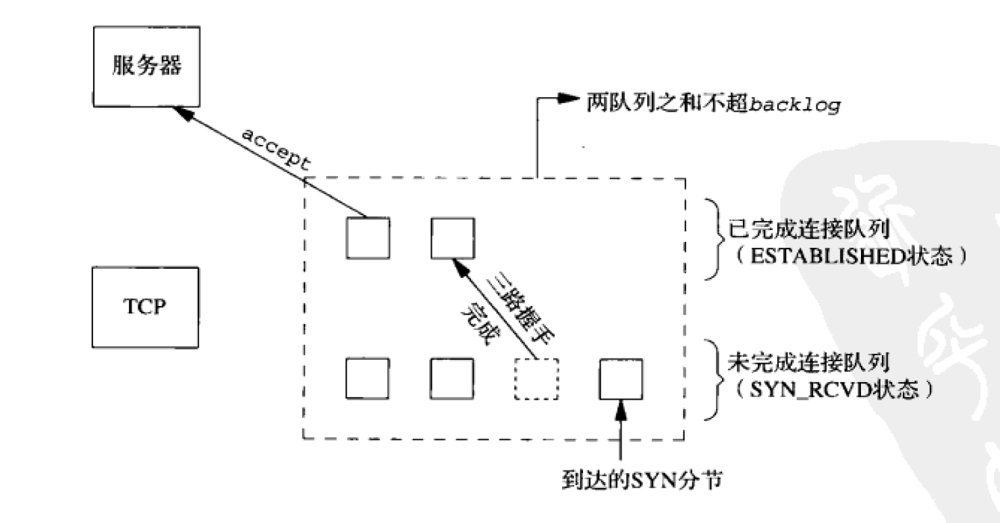
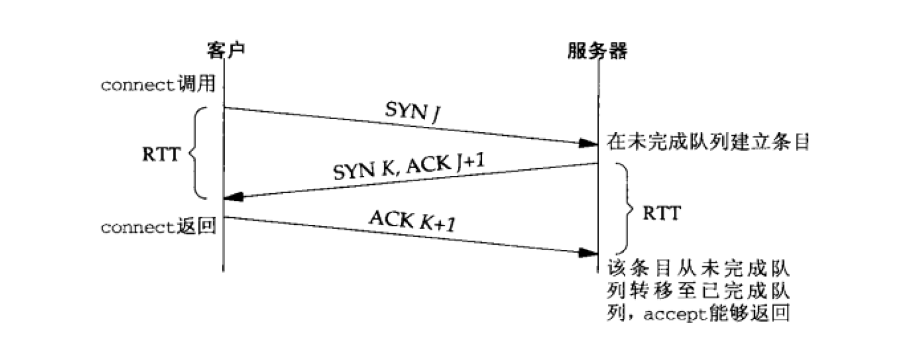
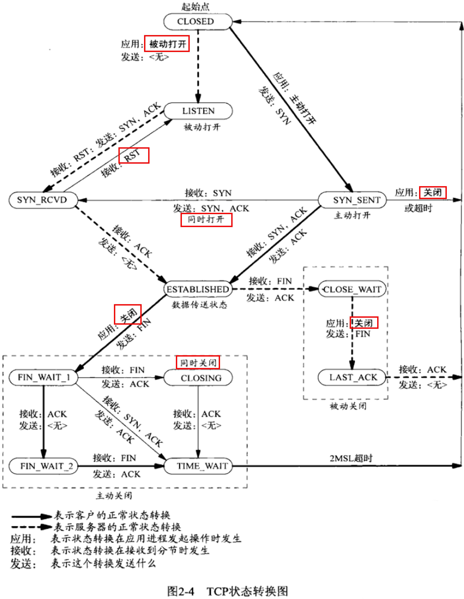
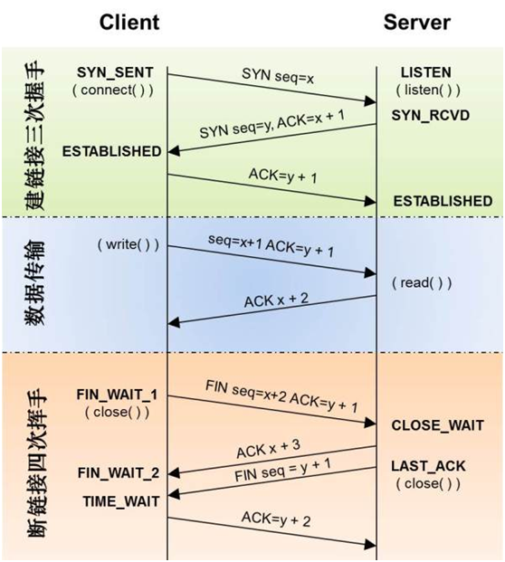

## Socket Intro
_Just Introduction, more on referred pages_

### Contents
- [What is the meaning of _backlog_ in `listen` ?](#listenbacklog)
- [What is the meaning of `TIME_WAIT`?](#timewait)
- [Say hwo to use `SO_REUSEADDR` and `SO_REUSEPORT`](#soreuseaddr)
- [Difference between the return value of `socket` and `accept`](#sockfd)
- [Which function is Blocking ?](#blocking)
- [How to set socket to **Non-Blocking**](#nonblocking)
- [TCP Sequence Number Transfer Graph](#tcpseq)
- [How Linux handle Network packets](#linuxnetpackets)

<a id=listenbacklog></a>
### Listen - _backlog_
- _listen_

> `Unix Network Programming` **Chapter 4.5** _Listen Function_
<http://www.masterraghu.com/subjects/np/introduction/unix_network_programming_v1.3/ch04lev1sec5.html>

```c
int listen(int sockfd, int backlog)
```

1. When a socket is created by the `socket` function, it is assumed to be an active socket, that is, a lient socket that will issue a `connect`. The `listen` function converts an unconnected socket into a passive socket, indicating that the kernel should accept incoming connection requests directed to this socket. In terms of the TCP state transition diagram, the call to `listen` moves the socket from the `CLOSED` state to the `LISTEN` state.

2. The second argument to this function specifies the _**maximum number of connections**_ the kernel should _queue_ for this socket.

- _backlog_

    To understand the `backlog` argument, we must realize that for a given listening socket, the kernel maintains two queues:

<div align=center></div>

1. An _**incomplete connection queue**_, which contains an entry for each `SYN` that has arrived from a client for which the server is awaiting completion of the `TCP three-way handshake`. These sockets are in `SYN_RCVD` state.
2. A _**completed connection queue**_, which contains an entry for each client with whom the `TCP three-way handshake` has completed. These sockets are in the `ESTABLISHED` state.
<div align=center></div>

- wrap for socket

    We allow the environment variable`LISTENQ ` to override the value specified by the caller.

```c
137 void
138 Listen (int fd, int backlog)
139 {
140     char    *ptr;

141         /* can override 2nd argument with environment variable */
142     if ( (ptr = getenv("LISTENQ")) != NULL)
143         backlog = atoi (ptr);

144     if (listen (fd, backlog) < 0)
145         err_sys ("listen error");
146 }
```

<a id=timewait></a>
### TIME_WAIT
- _TCP state transition graph_
<div align=center></div>

> `Unix Network Programming` **Chapter 2.7** _TIME\_WAIT state_
<http://www.masterraghu.com/subjects/np/introduction/unix_network_programming_v1.3/ch02lev1sec7.html><br>
<http://blog.51cto.com/yaocoder/1338567>

- There are two reasons for the `TIME_WAIT` state:
    - To implement TCP's full-duplex connection termination reliably
    - To allow old duplicate segments to expire in the network

<a id=soreuseaddr></a>
### `SO_REUSEADDR` && `SO_REUSEPORT`

> `Unix Network Programming` **Chapter 7.5** _Generic Socket Options_<br>
search `SO_REUSEADDR and SO_REUSEPORT Socket Options`<br>
<http://www.masterraghu.com/subjects/np/introduction/unix_network_programming_v1.3/ch07lev1sec5.html>
<https://stackoverflow.com/questions/14388706/socket-options-so-reuseaddr-and-so-reuseport-how-do-they-differ-do-they-mean-t><br>
allow bind to the same _IP address_ or same _IP port_<br>
 _**call `setsockopt` to set the `SO_REUSEADDR` socket option before calling `bind` in all TCP servers**_

```c
176  int usbip_net_set_reuseaddr(int sockfd)
177  {
178  	const int val = 1;
179  	int ret;
180  
181  	ret = setsockopt(sockfd, SOL_SOCKET, SO_REUSEADDR, &val, sizeof(val));
182  	if (ret < 0)
183  		dbg("setsockopt: SO_REUSEADDR");
184  
185  	return ret;
186  }
187  
```

> Definition of `setsockopt`

```c
1880  /*
1881   *	Set a socket option. Because we don't know the option lengths we have
1882   *	to pass the user mode parameter for the protocols to sort out.
1883   */
1884  
1885  SYSCALL_DEFINE5(setsockopt, int, fd, int, level, int, optname,
1886  		char __user *, optval, int, optlen)
1887  {
1888  	int err, fput_needed;
1889  	struct socket *sock;
1890  
1891  	if (optlen < 0)
1892  		return -EINVAL;
1893  
1894  	sock = sockfd_lookup_light(fd, &err, &fput_needed);
1895  	if (sock != NULL) {
1896  		err = security_socket_setsockopt(sock, level, optname);
1897  		if (err)
1898  			goto out_put;
1899  
1900  		if (level == SOL_SOCKET)
1901  			err =
1902  			    sock_setsockopt(sock, level, optname, optval,
1903  					    optlen);
1904  		else
1905  			err =
1906  			    sock->ops->setsockopt(sock, level, optname, optval,
1907  						  optlen);
1908  out_put:
1909  		fput_light(sock->file, fput_needed);
1910  	}
1911  	return err;
1912  }
1913   
```

_then come to `sock_setsockopt` when `level` == `SOL_SOCKET`_

```c
618  /*
619   *	This is meant for all protocols to use and covers goings on
620   *	at the socket level. Everything here is generic.
621   */
622  
623  int sock_setsockopt(struct socket *sock, int level, int optname,
624  		    char __user *optval, unsigned int optlen)
625  {
626  	struct sock *sk = sock->sk;
627  	int val;
628  	int valbool;
629  	struct linger ling;
630  	int ret = 0;
631  
632  	/*
633  	 *	Options without arguments
634  	 */
635  
636  	if (optname == SO_BINDTODEVICE)
637  		return sock_setbindtodevice(sk, optval, optlen);
638  
639  	if (optlen < sizeof(int))
640  		return -EINVAL;
641  
642  	if (get_user(val, (int __user *)optval))
643  		return -EFAULT;
644  
645  	valbool = val ? 1 : 0;
646  
647  	lock_sock(sk);
648  
649  	switch (optname) {
650  	case SO_DEBUG:
651  		if (val && !capable(CAP_NET_ADMIN))
652  			ret = -EACCES;
653  		else
654  			sock_valbool_flag(sk, SOCK_DBG, valbool);
655  		break;
656  	case SO_REUSEADDR:
657  		sk->sk_reuse = (valbool ? SK_CAN_REUSE : SK_NO_REUSE);
658  		break;
659  	case SO_REUSEPORT:
660  		sk->sk_reuseport = valbool;
661  		break;

... ...

```

<a id=sockfd></a>
### Listening socket && connected socket

- accept

> `accept` is called by a TCP server to return the next completed connection from the front of the _**completed connection queue**_ (Figure 4.7). If the completed connection queue is empty, the process is put to sleep (assuming the default of a blocking socket).

```c
#include <sys/socket.h>

int accept (int sockfd, struct sockaddr *cliaddr, socklen_t *addrlen);
```

1. If `accept` is successful, its return value is a **brand-new descriptor** automatically created by the kernel.
2. This new descriptor refers to the TCP connection with the client.

> When discussing `accept`, we call the first argument to accept _**the listening socket**_ (the descriptor created by socket and then used as the first argument to both `bind` and `listen`), and we call the return value from `accept` _**the connected socket**_.

#### _It is important to differentiate between these two sockets_
  
1. A given server normally creates only one _**listening socket**_, which then exists for the lifetime of the server.<br>
2. The kernel creates one _**connected socket**_ for each client connection that is accepted (i.e., for which the TCP `three-way handshake` completes). When the server is finished serving a given client, the _**connected socket**_ is closed.

<a id=nonblocking></a>
### Changing a socket from **Blocking** to **Non-Blocking**

- Example

```c
flags = fcntl(sockfd, F_GETFL, 0);
fcntl(sockfd, F_SETFL, flags | O_NONBLOCK);
```

- `fcntl` function

```c
// int fcntl(fd, F_SETFL, flags)
349  SYSCALL_DEFINE3(fcntl, unsigned int, fd, unsigned int, cmd, unsigned long, arg)
350  {
351  	struct fd f = fdget_raw(fd);
352  	long err = -EBADF;
353  
354  	if (!f.file)
355  		goto out;
356  
357  	if (unlikely(f.file->f_mode & FMODE_PATH)) {
358  		if (!check_fcntl_cmd(cmd))
359  			goto out1;
360  	}
361  
362  	err = security_file_fcntl(f.file, cmd, arg);
363  	if (!err)
364  		err = do_fcntl(fd, cmd, arg, f.file);
365  
366  out1:
367   	fdput(f);
368  out:
369  	return err;
370  }
```

_then go to_

```c
251  static long do_fcntl(int fd, unsigned int cmd, unsigned long arg,
252  		struct file *filp)
253  {
254  	long err = -EINVAL;
255  
256  	switch (cmd) {
257  	case F_DUPFD:
258  		err = f_dupfd(arg, filp, 0);
259  		break;
260  	case F_DUPFD_CLOEXEC:
261  		err = f_dupfd(arg, filp, O_CLOEXEC);
262  		break;
263  	case F_GETFD:
264  		err = get_close_on_exec(fd) ? FD_CLOEXEC : 0;
265  		break;
266  	case F_SETFD:
267  		err = 0;
268  		set_close_on_exec(fd, arg & FD_CLOEXEC);
269  		break;
270  	case F_GETFL:
271  		err = filp->f_flags;
272  		break;
273  	case F_SETFL:
274  		err = setfl(fd, filp, arg);
275  		break;

... ...
```

_final go to_

```c
29  #define SETFL_MASK (O_APPEND | O_NONBLOCK | O_NDELAY | O_DIRECT | O_NOATIME)
30  
31  static int setfl(int fd, struct file * filp, unsigned long arg)
32  {
33  	struct inode * inode = file_inode(filp);
34  	int error = 0;
35  
36  	/*
37  	 * O_APPEND cannot be cleared if the file is marked as append-only
38  	 * and the file is open for write.
39  	 */
40  	if (((arg ^ filp->f_flags) & O_APPEND) && IS_APPEND(inode))
41  		return -EPERM;
42  
43  	/* O_NOATIME can only be set by the owner or superuser */
44  	if ((arg & O_NOATIME) && !(filp->f_flags & O_NOATIME))
45  		if (!inode_owner_or_capable(inode))
46  			return -EPERM;
47  
48  	/* required for strict SunOS emulation */
49  	if (O_NONBLOCK != O_NDELAY)
50  	       if (arg & O_NDELAY)
51  		   arg |= O_NONBLOCK;
52  
53  	if (arg & O_DIRECT) {
54  		if (!filp->f_mapping || !filp->f_mapping->a_ops ||
55  			!filp->f_mapping->a_ops->direct_IO)
56  				return -EINVAL;
57  	}
58  
59  	if (filp->f_op && filp->f_op->check_flags)
60  		error = filp->f_op->check_flags(arg);
61  	if (error)
62  		return error;
63  
64  	/*
65  	 * ->fasync() is responsible for setting the FASYNC bit.
66  	 */
67  	if (((arg ^ filp->f_flags) & FASYNC) && filp->f_op &&
68  			filp->f_op->fasync) {
69  		error = filp->f_op->fasync(fd, filp, (arg & FASYNC) != 0);
70  		if (error < 0)
71  			goto out;
72  		if (error > 0)
73  			error = 0;
74  	}
75  	spin_lock(&filp->f_lock);
76  	filp->f_flags = (arg & SETFL_MASK) | (filp->f_flags & ~SETFL_MASK);
77  	spin_unlock(&filp->f_lock);
78  
79   out:
80  	return error;
81  }
```

- Macro for `cmd`

> Note for `F_SETFL`

```c
82  /* Values for the second argument to `fcntl'.  */
83  #define	F_DUPFD	  	0	/* Duplicate file descriptor.  */
84  #define	F_GETFD		1	/* Get file descriptor flags.  */
85  #define	F_SETFD		2	/* Set file descriptor flags.  */
86  #define	F_GETFL		3	/* Get file status flags.  */
87  #define	F_SETFL		4	/* Set file status flags.  */
88  #if defined __USE_UNIX98 || defined __USE_XOPEN2K8
89  #define	F_GETOWN	5	/* Get owner (receiver of SIGIO).  */
90  #define	F_SETOWN	6	/* Set owner (receiver of SIGIO).  */
91  #endif
92  #define	F_GETLK		7	/* Get record locking info.  */
93  #define	F_SETLK		8	/* Set record locking info (non-blocking).  */
94  #define	F_SETLKW	9	/* Set record locking info (blocking).  */
95  /* Not necessary, we always have 64-bit offsets.  */
96  #define F_GETLK64	F_GETLK	/* Get record locking info.  */
97  #define F_SETLK64	F_SETLK	/* Set record locking info (non-blocking).  */
98  #define F_SETLKW64	F_SETLKW/* Set record locking info (blocking).	*/

... ...
```


- Macro for `flag`

> Note for `O_NONBLOCK`

```c
24  /* File access modes for `open' and `fcntl'.  */
25  #define	O_RDONLY	0	/* Open read-only.  */
26  #define	O_WRONLY	1	/* Open write-only.  */
27  #define	O_RDWR		2	/* Open read/write.  */
28  
29  
30  /* Bits OR'd into the second argument to open.  */
31  #define	O_CREAT		0x0200	/* Create file if it doesn't exist.  */
32  #define	O_EXCL		0x0800	/* Fail if file already exists.  */
33  #define	O_TRUNC		0x0400	/* Truncate file to zero length.  */
34  #define	O_NOCTTY	0x8000	/* Don't assign a controlling terminal.  */
35  #define	O_ASYNC		0x0040	/* Send SIGIO to owner when data is ready.  */
36  #define	O_FSYNC		0x0080	/* Synchronous writes.  */
37  #define	O_SYNC		O_FSYNC
38  #ifdef	__USE_MISC
39  #define	O_SHLOCK	0x0010	/* Open with shared file lock.  */
40  #define	O_EXLOCK	0x0020	/* Open with shared exclusive lock.  */
41  #endif
42  #ifdef __USE_XOPEN2K8
43  # define O_DIRECTORY	0x00200000	/* Must be a directory.	 */
44  # define O_NOFOLLOW	0x00000100	/* Do not follow links.	 */
45  # define O_CLOEXEC	0x00400000      /* Set close_on_exec.  */
46  #endif
47  #if defined __USE_POSIX199309 || defined __USE_UNIX98
48  # define O_DSYNC	0x00010000	/* Synchronize data.  */
49  # define O_RSYNC	0x00020000	/* Synchronize read operations.	 */
50  #endif
51  
52  /* All opens support large file sizes, so there is no flag bit for this.  */
53  #ifdef __USE_LARGEFILE64
54  # define O_LARGEFILE	0
55  #endif
56  
57  /* File status flags for `open' and `fcntl'.  */
58  #define	O_APPEND	0x0008	/* Writes append to the file.  */
59  #define	O_NONBLOCK	0x0004	/* Non-blocking I/O.  */

... ...
```

<a id=linuxnetpackets></a>
### Linux Handle Network Packets
<https://segmentfault.com/a/1190000008836467>

<a id=blocking></a>
### Which Function is Blocking ?
> `socket` `listen` `bind` is Non-Blocking<br>
`connect` `accept` is Blocking

<a id=tcpseq></a>
### TCP Sequence Number Transfer Graph
<div align=center></div>